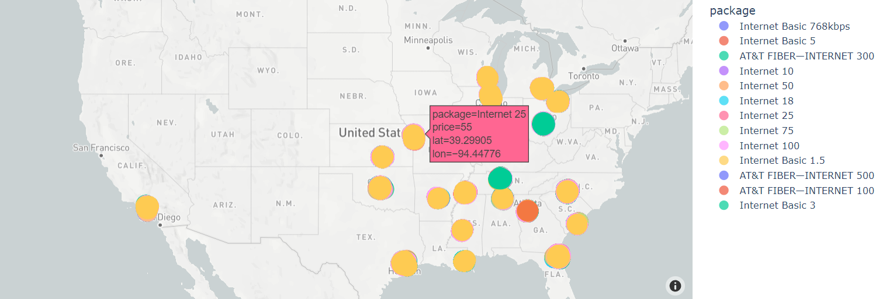

InternetServicePrice_Prediction
============================================

Comprehensive predictive analysis on how Internet Service Prices vary across different geographics, demographics etc. for improved internet access and affordability.

The project can be well understood by this [blog](https://medium.com/@priyanka_60002/cis-5450-final-project-blog-22f1483fd424 ) - https://medium.com/@priyanka_60002/cis-5450-final-project-blog-22f1483fd424

### Requirements

The model is built in an Anaconda Environment (Jupyter Notebook) and Python 3.5.0. All the libraries which need to be downloaded are mentioned in requirements.txt.

### Installation + Usage
- Install Python3 or above using Anaconda or any other method
- Install the requirements using pip install -r requirements.txt in Anaconda Prompt
- Clone this repo to your local machine
- Extract the zip file you downloaded
- Open a Python editor like Jupyter Notebook 
	* You may create and use a virtual environment to work on this project
- Run CIS545_Project_final.ipynb

### Dataset Description

The project makes use of 5 csv files downloaded from [here](https://www.kaggle.com/datasets/michaelbryantds/internet-speeds-and-prices ),  namely:

1. speed_price_att.csv - contains internet plans data for AT&T network for major states of USA
2. speed_price_att_other_cities.csv - contains internet plans data for AT&T network for Ohio & Tennessee states of USA
3. speed_price_centurylinik.csv - contains internet plans data for Centurylink network for major states of USA
4. speed_price_earthlink.csv - contains internet plans data for Earthlink network for major states of USA
5. speed_price_verizon.csv - contains internet plans data for Verizon network for major states of USA

### Pipeline
- Data Pre processing
	* Handling Null values
	* Handling abnormal negative values
	* Date time conversion
- Exploratory Data Analysis & Visualization
	* Univariate Analysis & Multivariate Analysis
	* Heatmap
	* Dynamic plotly geographic maps to understand market share
- Feature Engineering
	* Outlier analysis
	* Feature Encoding
- Modeling & Hyper parameter optimization

    

### Results

20 different versions of ML and DL models were implemented. The results are given below : 

    

